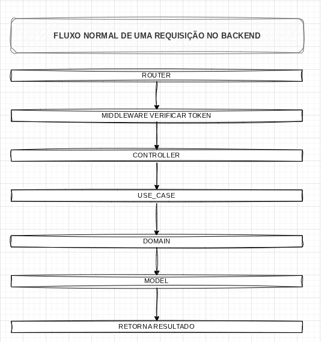
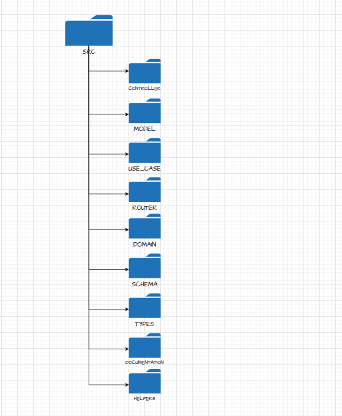
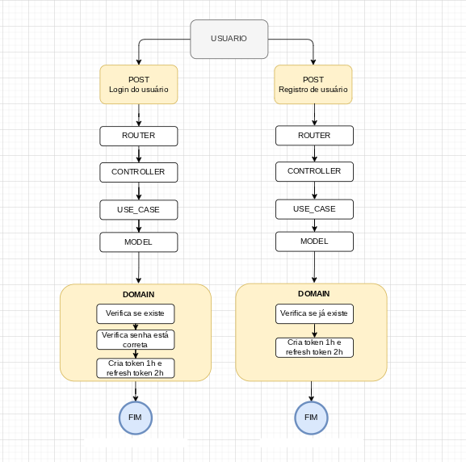
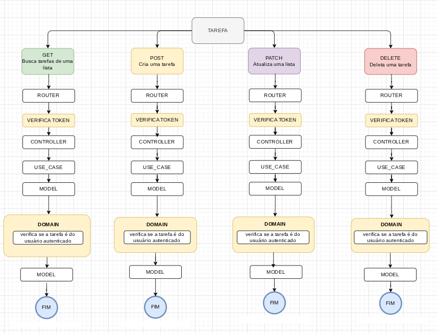

# BextTesteBackend

## 1. Comandos Obrigatórios (Setup)

Antes de iniciar o projeto, é obrigatório rodar os comandos abaixo para preparar o ambiente:

**1. Instalar as dependências:**

```bash
npm install
```

**2. Gerar o diagrama ERD:**

Utilizo o **LIAM ERD** para mapear as collections. Rode o comando abaixo para gerar o diagrama das entidades:

```bash
npm run dbml
```

---

## 2. Variáveis de Ambiente (`.env`)

É obrigatório criar um arquivo chamado `.env` na raiz do projeto contendo as seguintes variáveis:

```env
JSON_WEB_TOKEN_AUTH_USER="5as9das655as8w"
JSON_WEB_REFRESH_TOKEN_AUTH_USER="5as9d9as6a2as5d98"
MONGODB_URI='mongodb://localhost:27017/BextTesteGuilherme'
```

---

## 3. Rodando o Projeto

Com tudo configurado, você pode utilizar os comandos abaixo:

**Iniciar o ambiente de desenvolvimento:**

```bash
npm run dev
```

**Rodar os testes:**

```bash
npm run test
```

---

## 4. Documentação da API

Quando o projeto estiver rodando localmente, você pode acessar a documentação nestes links:

| Recurso               | URL                                                |
| --------------------- | -------------------------------------------------- |
| Documentação API      | http://localhost:3000/docs/api                     |
| Especificação OpenAPI | http://localhost:3000/docs/openapi.json            |
| Diagrama ERD          | http://localhost:3000/docs/erd?showMode=ALL_FIELDS |

---

## 5. Visão Geral do Sistema

Desenvolvi o backend seguindo os princípios de **Clean Architecture** e partes do **DDD**.

A paginação nas listas e tarefas foi idealizada para casos onde ambas podem crescer exponencialmente. Em casos onde tarefas e listas costumam ser pequenas, o ideal seria utilizar o populate do MongoDB e trazer tudo no mesmo JSON.

Para as Tarefas eu adicionei um limite de 30 itens por requisição e paginei para não sobrecarregar o banco de dados.

Para as Listas também adicionei um limite na busca de 10 itens e paginei o restante também para evitar sobrecarga.

Todas as rotas são extremamente seguras a ponto do usuário só poder atualizar apenas oque pertence a ele.

### Fluxo Padrão da Arquitetura Backend

Requisições transitam entre as camadas da API, desde a entrada no servidor até a resposta final.



---

## 6. Organização do Projeto

### Estrutura de Pastas e Arquivos

Organização modular do código-fonte dentro do diretório `src/`, destacando a separação de responsabilidades.



---

## 7. Fluxos de Negócio e Casos de Uso

### Fluxo de Autenticação do Usuário

Diagrama detalhado do processo de login e registro, incluindo a geração de tokens e as validações de segurança.



### Fluxo de Domínio: Gestão de Tarefas

Este diagrama representa a lógica de negócio principal para a criação, atualização e listagem de tarefas dentro do domínio da aplicação.



---

## 8. Meu Fluxo de Commit

Para manter o repositório organizado, sigo este fluxo de comandos na hora de enviar o código para produção:

```bash
git init
git add .
git commit -m "✨ feat: "
git push -u origin producao
```
